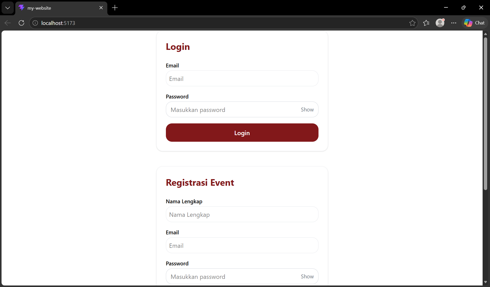
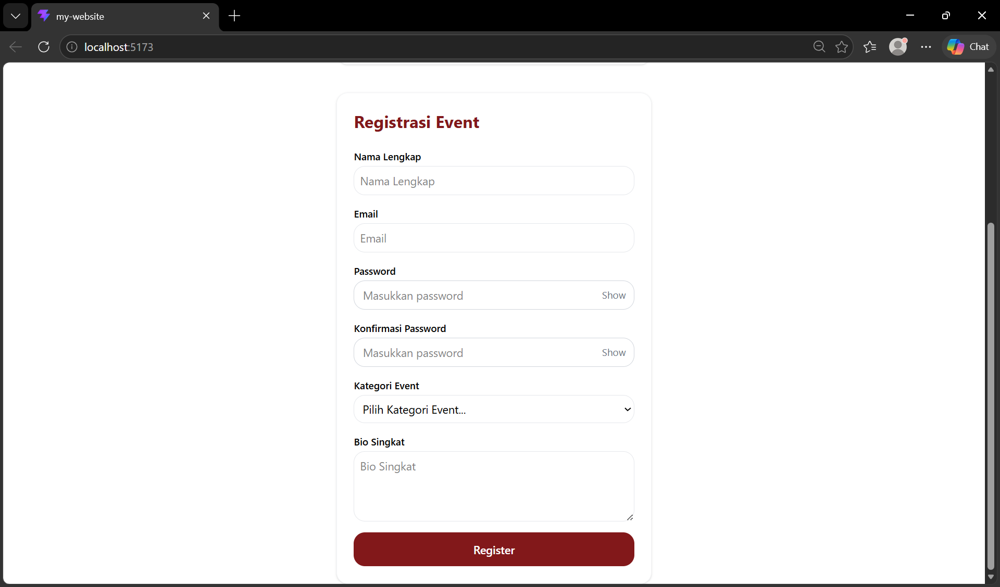

# Tugas Mandiri: Membangun Web Design System (Form & Interactive Components)

Tugas ini adalah bagian dari Pertemuan 3 yang fokus pada pembuatan komponen form reusable, validasi menggunakan Zod, dan manajemen form dengan React Hook Form.

##  Fitur Utama
- **Atomic Design**: Komponen dasar (Atoms) yang reusable (Input, Password, Select, Button).
- **Schema Validation**: Validasi input menggunakan library **Zod**.
- **Real-time Feedback**: Pesan error muncul otomatis jika input tidak sesuai.
- **Show/Hide Password**: Fitur UX untuk melihat atau menyembunyikan password.
- **Loading State**: Simulasi pengiriman data dengan efek loading pada tombol.

## 📸 Screenshots
Berikut adalah hasil akhir dari Form Login dan Registrasi:

### 1. Form Login

### 2. Form Registrasi Event

### 3. Error Login

## 🔗 Link Pengumpulan
- **Repository GitHub**: []
- **Live Deployment (Vercel)**: []

---